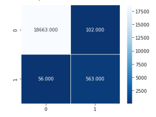
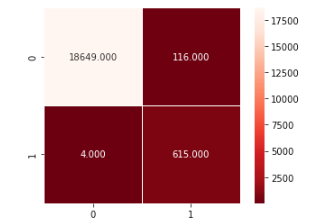

# Report: Credit Risk Classification

## Overview of the Analysis

In credit risk management, losses due to a borrower's failure to meet contractual obligations are commonly mitigated by determining the creditworthiness of potential borrowers and their ability to honor their debt obligations. In this study, a supervised machine learning logistical model was developed from historical data to determine the probability of a loan being healthy or high-risk, binomially identified by 0 and 1 respectively, using the following loan features:

* Loan size
* Interest rate
* Borrower income
* Debt-to-income ratio
* Number of accounts
* Derogatory marks
*	Total debt

For the purposes of model developments, the loan status in the historical data was assumed to represent the probability of a loan being healthy or high-risk.

The scikit-learn Python library was employed in these analyses.

The historical data consisted of 75,036 healthy and 2,500 high-risk loans. By default of the splitting method used, these data were randomly divided into 75% for model training and 25% for model testing.

As a first stage, the training data were fit into the logistic regression model (Model 1) for it to learn from these observations. The data included all the loan features listed above, as well as the corresponding loan status. 

Subsequently, the logistic regression model was provided with the features of the test data in order to make predictions of the loan status for each of the loans.

To assess the effect of bias on the model due to imbalanced data in the training dataset, the training data was balanced through random oversampling. This oversampled training dataset was ensuingly fit into the logistic regression model (Model 2), which was inturn was provided with the features of the test data to make new predictions of the loan status.

The results of the predictions made by the model using the original and the oversampled training data were accordingly compared by assessing the model's accuracy against the true loan status values.

## Results

* *Machine Learning Model 1:* Logistic Regression Model trained with imbalanced data
  * Accuracy: 95.2%
  * Precision:scores
    * Healthy loan: 1.00
    * High-risk loan: 0.85
  * Recall scores:
    * Healthy loan: 0.99
    * High-risk loan: 0.91
  * Confusion matrix:
  
    

* *Machine Learning Model 2:* Logistic Regression Model trained with balanced oversampled data
  * Accuracy: 99.4%
  * Precision:scores
    * Healthy loan: 1.00
    * High-risk loan: 0.84
  * Recall scores:
    * Healthy loan: 0.99
    * High-risk loan: 0.99
  * Confusion matrix:

    

## Summary

From the results presented above, Model 2 exhibited a higher accuracy than Model 1, likely due to the random oversampling of the training data (i.e., oversampling the minority and undersampling the majority of the data). The effect this has on the model is that it removes any bias that may cause the algorithm to fully/partially ignore the minority class. 

Additionally, it is noted that the recall for high-risk loans also increased after oversampling of the training data for Model 2, which in a higher f1-score than Model 1. 

In conclusion, Model 1 is shown to have a lower accuracy than Model 2, because the training data was heavily imbalanced toward healthy loans (for every high-risk loan, there were approximately 30 healthy ones). This resulted in a model that mismatched a total of 56 loans, labeling them as healthy, when they were actually high-risk. Model 2, which was trained using balanced training data (i.e., same number of healthy and high-risk loans) shows in contrast only 4 instances of such a mismatch, thus resulting in an improved accuracy. 

With regards to the general application of a logistic regression model, the observations above exemplify the need to understand the problem to be solved, as well as the training data before deploying the model. There might be cases where theim data does not produce high risk results, and so the bias influenced by such data can be disregrded. In other cases, however, this skewness in the data can result in the algorithm entirely ignoring the minority class, and so the model may not be valid.

